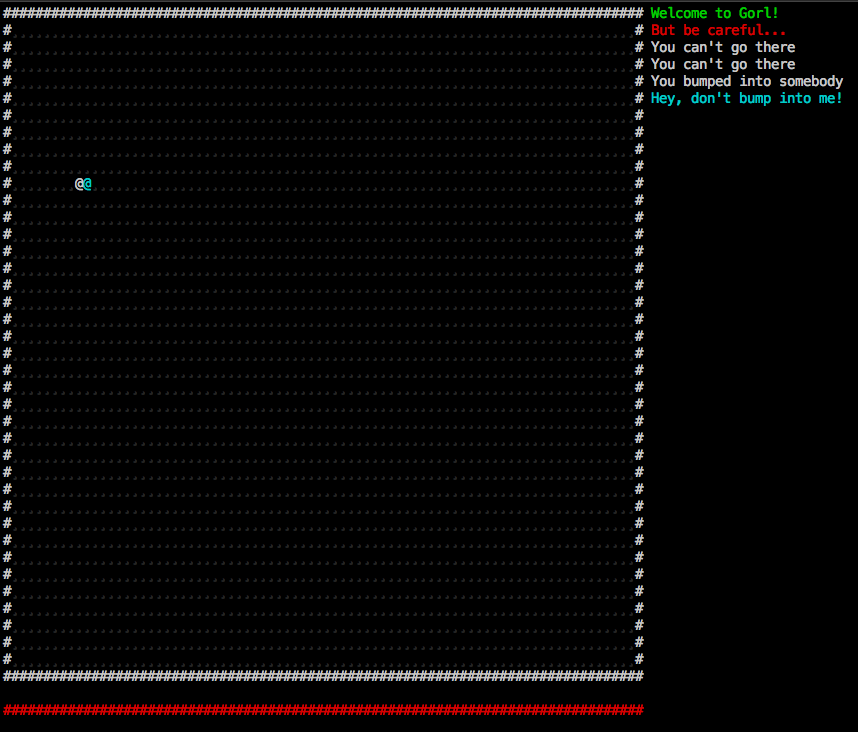

# gorl

Gorl is a skeleton of a roguelike written in go. There's no game here (yet), but gorl does implement a world where you can move around, other entities, impassable tiles, a health bar, and an event log.

## Todo

[ ] Fix collision handling so the right entity triggers the effect
[ ] Make it possible to kill enemies. Add heals
[ ] Add a FOV mechanic, incl. range of sight
[ ] Add level building tool
[ ] Improve enemy pathfinding
